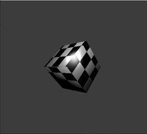
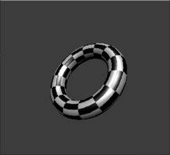
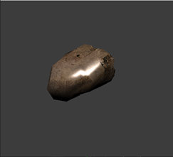
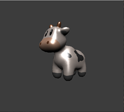
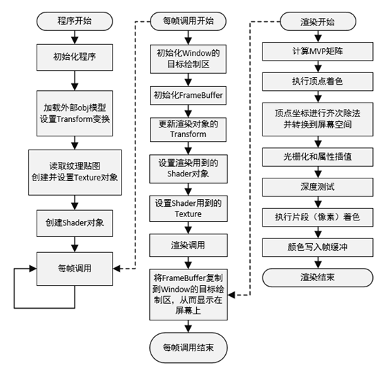

# 基于C++的软件光栅化渲染器

## 介绍

此项目是我的毕业设计，使用C++从零设计了一个软光栅渲染器，使用面向对象方式设计，没有任何依赖库，总代码量大约2700行。  

我将这个项目开源，大家可以参考学习，用到的图形学算法都是光栅化渲染中最基础的算法，网上可以搜到很多相关文章，在此列出一些相关资料供大家参考：

1. [[教程]技术美术入门：渲染管线概述](https://www.bilibili.com/video/BV1Q54y1G7v3/?share_source=copy_web&vd_source=77b46b29f4f7cb5d443b63654b67194a) 讲述了渲染管线全流程

1. [光栅化算法](https://zhuanlan.zhihu.com/p/566989401) 也可以参考第一条

1. [透视矫正插值](https://zhuanlan.zhihu.com/p/403259571)

1. [投影矩阵推导](https://zhuanlan.zhihu.com/p/662940110) 这篇是我自己的文章

这个渲染器渲染效率很低，我不打算继续维护或扩展，后续会在Unity中继续学习图形算法。如果有时间，可能使用图形库opengl或vulkan等自己从头实现PRB、全局光照等高级渲染方法。

## 渲染效果

## 实现的渲染功能

- 自己实现加载 .obj 文件的功能，只能加载三角形网格，并且包含法线和uv的.obj文件，项目Sandbox\asset文件夹中的obj文件应该都可以使用（超过100k的模型渲染帧率巨低）。`\SoftRenderer\Asset\ResourceManager`
- 模仿OpenGL实现VertexBuffer和IndexBuffer，具体实现参考`SoftRenderer\Render\Buffer`
- 实现了基本的向量和矩阵运算。参考`SoftRenderer\SRMath`文件夹（并没有经过精心的设计和优化，只是能用而已）
- 实现Transform变换，包括旋转、缩放、平移。`SoftRenderer\Render\Transform`（有的地方Transform不小心写成了Translation）
- Camera的表示：Transform + 四参数（aspect、fov、near、far）。`\SoftRenderer\Render\Camera`
- 光栅化过程，使用边界扫描算法，参考《计算机图形学入门：3D渲染指南》$^{[8]}$这本书。（这部分写的最烂，不建议参考我的代码）见`SoftRenderer\Render\Renderer`中的`Renderer::Rasterize`方法
- 关于着色器，可以定义自己的着色器类继承自`VertexShader`或`FragmentShader`，并重新实现Execute函数。着色器基类`VertexShader`和`FragmentShader`默认使用无光照着色，我另外实现了Blinn-Phong着色器，参考`SoftRenderer\Render\Light_Shader`
- 实现了简单的UV映射，可以采样贴图（最近邻采样），具体实现见`SoftRenderer\Render\Texture`
- 帧缓冲FrameBuffer，包含colorBuffer和Z-Buffer，具体设计和实现参考`SoftRenderer\Render\FrameBuffer`
- 渲染管线全流程见`SoftRenderer\Render\Renderer`中的`OnRender`方法

## 运行流程图

## 参考文献

顺便列出毕设论文的参考文献：

[1] Jason Gregory. 游戏引擎架构（第二版）[M]. 北京：电子工业出版社，2019. 401-432.  
[2] Pal. Real-Time 3D Rendering with Directx and HLSL [M]. New York: Varcholik, 2015.   127-144.  
[3] 肖月. 三维图形引擎中渲染器的研究与设计[D]. 长春：长春工业大学，2019. 1-2.  
[4] 俞骁尧. 基于众核架构的软件渲染器设计与实现[D]. 杭州：浙江大学，2016. 1-2.  
[5] Donald Hearn, M. Pauline Baker, Warren R. Carithers. 计算机图形学（第四版）[M]. 北京：电子工业出版社，2014. 1-24.  
[6] 李晓武. 计算机图形学原理、算法及实践[M]. 北京: 清华大学出版社，2018. 3-12.  
[7] John Kessenich, Gracham Sellees, Dave Shreiner. OpenGL编程指南（原书第9版）[M]. 北京：机械工业出版社，2017. 7-10.  
[8] Gabriel Gambetta. 计算机图形学入门 3D渲染指南[M]. 北京：人民邮电出版，2022. 95-101.  
[9] 沈阳. 基于SIMD指令的多核软件渲染器的设计与实现[D]. 杭州：浙江大学，2015. 24-25.  
[10] 刘钊. 基于Tile的三角形光栅化算法研究与实现[D]. 西安：西安电子科技大学，2019. 26-27.  
[11] Liu Fang, Liu Xianmei. Research and Application on the Method of 3DS File Read, Render and Control[J]. AASRI Procedia, 2012, 1: 177-182.  
[12] 蒂芬•普拉达 (Stephen Prata). C++ Primer Plus中文版（第6版） [M]. 北京: 人民邮电出版社出版, 2016. 409-414.  
[13] 冯乐乐. Unity Shader入门精要[M]. 北京: 人民邮电出版社，2016. 121-136.  
[14] 崔馨平. 用OpenGL实现现代实时光栅化渲染引擎[D]. 北京：北京邮电大学，2021. 50-55.  
[15] Christiane Ulbricht, Alexander Wilkie, Werner Purgathofer. Verification of Physically Based Rendering Algorithms[J]. Computer Graphics Forum, 2006, 25: 237-255.

## 问题反馈

有任何问题可以联系我  
QQ：779553699  
WeChat：d779553699  
E-Mail：yujie-ding@qq.com